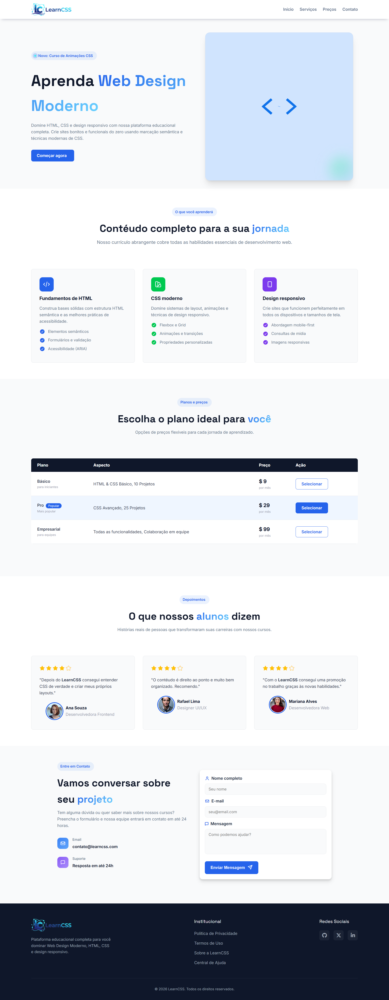

<h3 align="center"> ✅ Links de Validação & Status </h3>

| Status & Badges | Validação W3C | Preview |
| :---: | :---: | :---: |
|        | [HTML](https://validator.w3.org/nu/?doc=https%3A%2F%2Flanding-educacional.vercel.app%2F)    [CSS](https://jigsaw.w3.org/css-validator/validator?uri=https%3A%2F%2Flanding-educacional.vercel.app%2F) | [Landing Page - LearnCSS](https://landing-educacional.vercel.app/) |

Projeto desenvolvido como parte da atividade prática de HTML & CSS da trilha de Desenvolvimento Frontend VTEX.IO ministrado pela Growdev. O desafio consistiu em transformar um layout do [Figma](https://www.figma.com/make/RZ93PPFasAkeS1uYA8Vs0x/Educational-Wireframe-Design?p=f&t=pO0TnchKbZNEkx9M-0&fullscreen=1) em uma página web funcional, responsiva e semanticamente correta.

<h3>🎯 Objetivo do Projeto</h3>

Consolidar habilidades fundamentais de desenvolvimento web, com foco em:

- Autonomia técnica
- Raciocínio estrutural
- Construção de páginas responsivas e acessíveis

<h3>🛠️ Tecnologias Utilizadas</h3>

- HTML5 → Estrutura semântica para melhor acessibilidade e SEO

- CSS3 → Estilização avançada com variáveis (Custom Properties)

- Flexbox & Grid Layout → Técnicas modernas para alinhamento e distribuição de elementos

- Responsividade → Media Queries e unidades relativas (rem, vh, vw, clamp())

- [Font Awesome](https://fontawesome.com/) e [Lucide](https://lucide.dev/icons/) Icons → Ícones vetoriais para interface

<h3>💡 Destaques da Implementação</h3>

- Estrutura de Boxes → Rodapé e seções otimizados para hierarquia plana e manutenção simples

- Identidade Visual → Logo oficial e paleta de cores consistente com o protótipo

- Interface Limpa → Formulário de contato com ícones contextuais e botões interativos

- Sem Frameworks → Layout construído apenas com CSS puro, demonstrando domínio das propriedades

<h3> 📏 Regras Seguidas no Desafio</h3>

- [x] Não utilizar frameworks CSS (Bootstrap, Tailwind etc.)
- [x] Não utilizar JavaScript
- [x] Seguir o layout do Figma como referência visual
- [x] Código próprio e organizado

<h3>📁 Estrutura de Pastas</h3>

├── assets/  
├── index.html  
├── style.css  
└── README.md

📅 Entrega

- Data: 25/01/2026
- Instrutora: @leticialeal

<h3> 🧑‍💻 Autor</h3>

Desenvolvido por Emerson Pessoa  
[Linkedin](https://www.linkedin.com/in/emersonpessoa01/)
